# **Traffic Sign Recognition** 

The goal of this project is to learn deep neural network and convolutional neural network and apply learned concepts to build and train a model that can be used to classify traffic signs. This document describes various steps used in the pipeline, the approach and performance of the model.

## Dataset Summary

We are using subset of German Traffic Signs Dataset for this project. This data is in pickled format. Pickle library is used to extract and load data from dataset files. The dataset is divided in three groups - training dataset, validation dataset and test dataset. There are total 34799 training images, 4410 validation images, and 12630 test images. All images are of size 32x32 in BGR format.

**Data Samples**

Dataset consists of total 43 different classes as follows:

| ClassId | SignName                                     | ClassId | SignName                                           |
|:--------|:---------------------------------------------|:--------|:---------------------------------------------------|
|  0      | Speed limit (20km/h)                         | 22      | Bumpy road                                         |
|  1      | Speed limit (30km/h)                         | 23      | Slippery road                                      |
|  2      | Speed limit (50km/h)                         | 24      | Road narrows on the right                          |
|  3      | Speed limit (60km/h)                         | 25      | Road work                                          |
|  4      | Speed limit (70km/h)                         | 26      | Traffic signals                                    |
|  5      | Speed limit (80km/h)                         | 27      | Pedestrians                                        |
|  6      | End of speed limit (80km/h)                  | 28      | Children crossing                                  |
|  7      | Speed limit (100km/h)                        | 29      | Bicycles crossing                                  |
|  8      | Speed limit (120km/h)                        | 30      | Beware of ice/snow                                 |
|  9      | No passing                                   | 31      | Wild animals crossing                              |
| 10      | No passing for vehicles over 3.5 metric tons | 32      | End of all speed and passing limits                |
| 11      | Right-of-way at the next intersection        | 33      | Turn right ahead                                   |
| 12      | Priority road                                | 34      | Turn left ahead                                    |
| 13      | Yield                                        | 35      | Ahead only                                         |
| 14      | Stop                                         | 36      | Go straight or right                               |
| 15      | No vehicles                                  | 37      | Go straight or left                                |
| 16      | Vehicles over 3.5 metric tons prohibited     | 38      | Keep right                                         |
| 17      | No entry                                     | 39      | Keep left                                          |
| 18      | General caution                              | 40      | Roundabout mandatory                               |
| 19      | Dangerous curve to the left                  | 41      | End of no passing                                  |
| 20      | Dangerous curve to the right                 | 42      | End of no passing by vehicles over 3.5 metric tons |
| 21      | Double curve                                 |         |                                                    |

Following image shows example of each class in dataset:

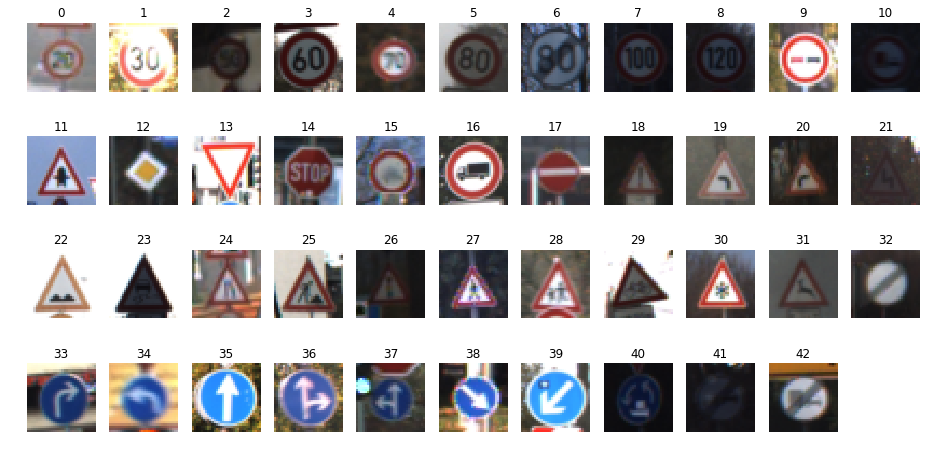

**Visualization**

Here is an exploratory visualization of distribution of images of each class in the dataset :

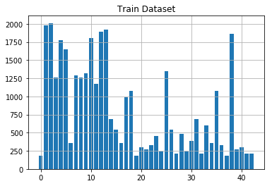
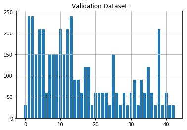
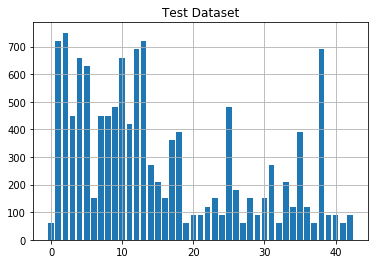

**_NOTE:_** _while importing cv2, if you get following error, run `apt-get install libgtk2.0-dev`_

**ImportError: libgtk-x11-2.0.so.0: cannot open shared object file: No such file or directory**

## Design

**Preprocessing Pipeline**

For preprocessing we tried different techniques like grayscale, normalization, etc. But using just one or two technique was not enough. Better image processing pipeline was required because some images were not clear, some were very dark. So first, input image is converted to LAB format. Using LAB format, it is possible to separate lightness (L) channel and enhance it. CLAHE (Contrast Limited Adaptive Histogram Equalization) is applied on Lightness channel to improve contrast. Output image is then again converted back to original BGR image format. Following image shows output after applying CLAHE on Lightness channel:

| Original image                                        | CLAHE output                                         |
|:------------------------------------------------------|:-----------------------------------------------------|
| 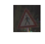 | 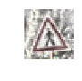 |

This light and contrast enhanced image is then converted to grayscale. Converting grayscale helps because number of channels are reduced to 1 thus speeding up the training process still keeping all image features. Following image shows output after grayscale conversion:

| CLAHE output                                         | Grayscale output                                             |
|:-----------------------------------------------------|:-------------------------------------------------------------|
|  | 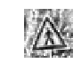 |

Finally, this grayscale image is normalized because having wider distribution in the data makes it more difficult to train. This is done using `normalized = ((grayscale - 128) / 128)`. After normalization, all image data ranges between -1 and 1.

**Model Architecture**

Basic LeNet architecture is used to start with. Since input image is normalized grayscale image, it has only one channel, hence basic LeNet architecture can be used as it is, just by changing output layer to output 43 classes. But this does not give the desired accuracy. So, dropout is used after both convolutional layers. Training accuracy is improved with this. Dropout is then applied after next two fully connected layers also. This helped to improve validation accuracy. Final Model looks like this:

| Layer           | Description                                 |
|:----------------|:--------------------------------------------|
| Input           | 32x32x1 grayscale image                     |
| Convolution 5x5 | 1x1 stride, valid padding, outputs 28x28x6  |
| RELU            | activation                                  |
| Dropout         | keep probability 0.7                        |
| Max pooling     | 2x2 stride, outputs 14x14x6                 |
| Convolution 5x5 | 1x1 stride, valid padding, outputs 10x10x16 |
| RELU            | activation                                  |
| Dropout         | keep probability 0.7                        |
| Max pooling     | 2x2 stride, outputs 5x5x16                  |
| Flatten         | outputs 400                                 |
| Fully connected | output 120                                  |
| RELU            | activation                                  |
| Dropout         | keep probability 0.7                        |
| Fully connected | outputs 84                                  |
| RELU            | activation                                  |
| Dropout         | keep probability 0.7                        |
| Fully connected | outputs 43 logits                           |

## Training

**Training Approach**

To start with, basic LeNet architecture was used. It gave validation accuracy of 89%. Then preprocessing pipeline was implemented with grayscale and normalization. That helped to increase validation accuracy to 91%. After increasing epochs, 92% of validation accuracy was achieved. To further improve the model, dropout was introduced. That helped to improve accuracy to 94%. After adding CLAHE in preprocessing, finally validation accuracy of 96% was achieved.

For training the model, Adam Optimizer is used with 0.001 as learning rate. Adam Optimizer is different than the classic Stochastic Gradient Descent. In Stochastic Gradient Descent, learning rate does not change during training. Where as in Adam Optimizer, learning rate is adapted as learning unfolds. It gives better results, also it is fast. Standard batch size of 128 is used, but different epochs were tried. For the final implementation, epochs 20 is used.

**Model Results**

Final model results are:

Training Accuracy = **99.6%**

Validation Accuracy = **96.3%**

Test Accuracy = **94.9%**

## Test on New Images

5 images of German Traffic Signs were downloaded from internet. These images are of different sizes. It was first resized to (32x32). After resizing images looked like this:

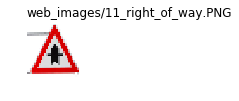

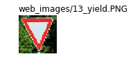

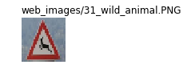

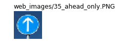

**Predictions**

These resized images are then passed through preprocessing pipeline and trained model is run to output prediction for each image. 
Results of the prediction are as follows:

| INPUT IMAGE                    | PREDICTION                            |
|:-------------------------------|:--------------------------------------|
| web_images/11_right_of_way.PNG | Right-of-way at the next intersection |
| web_images/13_yield.PNG        | Yield                                 |
| web_images/31_wild_animal.PNG  | Wild animals crossing                 |
| web_images/35_ahead_only.PNG   | Ahead only                            |
| web_images/40_roundabout.PNG   | Roundabout mandatory                  |

Model was able to predict all 5 traffic signs correctly giving accuracy of 100%.

**Softmax Probabilities**

Following softmax probabilities were calculated by model for each image:

| INPUT IMAGE                    | SOFTMAX P1   | SOFTMAX P2  | SOFTMAX P3 | SOFTMAX P4 | SOFTMAX P5 |
|:-------------------------------|:------------:|:-----------:|:----------:|:----------:|:----------:|
| web_images/11_right_of_way.PNG | 11 :  98.85% | 30 :  0.48% | 26 : 0.26% | 18 : 0.15% | 27 : 0.13% |
| web_images/13_yield.PNG        | 13 : 100.00% | 12 :  0.00% | 38 : 0.00% | 14 : 0.00% | 39 : 0.00% |
| web_images/31_wild_animal.PNG  | 31 :  72.26% | 21 : 21.47% | 29 : 2.67% | 19 : 1.50% | 23 : 1.08% |
| web_images/35_ahead_only.PNG   | 35 :  99.87% | 18 :  0.06% | 15 : 0.04% |  3 : 0.01% | 33 : 0.01% |
| web_images/40_roundabout.PNG   | 40 :  90.68% | 12 :  6.93% | 15 : 0.44% | 34 : 0.43% | 16 : 0.33% |

For "Yield " sign, prediction was 100% accurate, whereas "Wild Animal" sign was relatively difficult.
